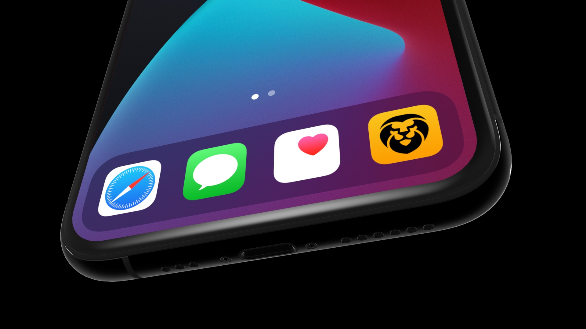
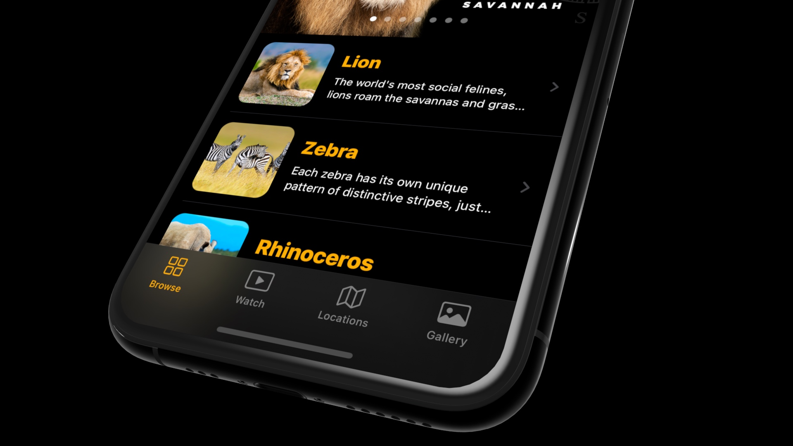
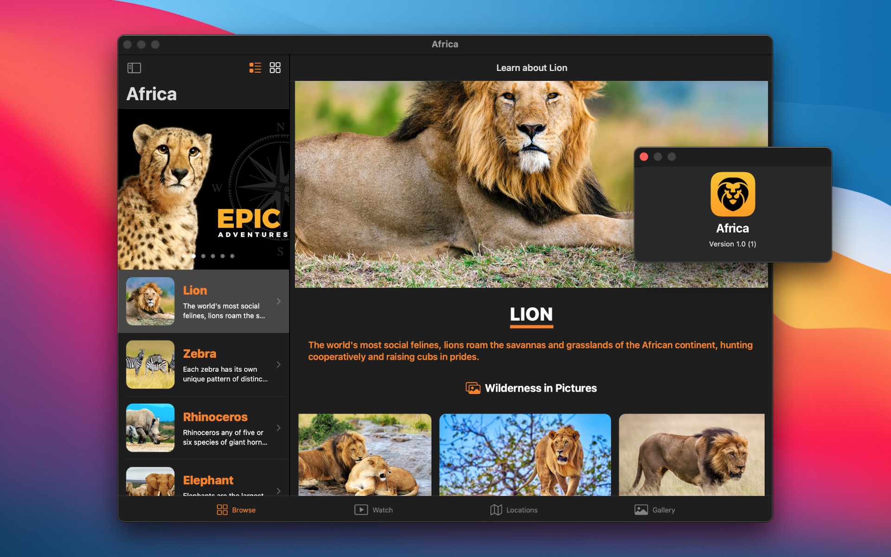

# SwiftUI 2 - Africa
 

  
  

    One thing is sure, we will discover new programming concepts and more new SwiftUI 2 features in this section.
  

<!-- 

 -->

## Topics are covered:

- [x] JSON with Swift (basic and advanced approach),
- [x] Grid Layouts (basic and advanced approach with a cool feature),
- [x] MapKit Integration (basic and advanced approach with another cool feature),
- [x] Video Player (new SwiftUI 2 feature),
- [x] Launch Screen (new way),
- [x] Swift programming concept: Extension,
- [x] Swift programming concept: Generics,
- [x] Prototype the whole application with SwiftUI 2 framework,
- [x] Design and improve the User Experience,
- [x] iMessage Sticker Pack,
- [x] Bring the full iPadOS app to macOS 11 Big Sur using Mac Catalyst technology,
- [x] Learn what is Pseudocode and why it is important,
- [x] What is a Bundle and Extension in app development and how to use them, etc.

## Demo

  
  

    Professional iOS 14 app icon on the home screen
  

  
  

    Complex layout system with 1 list and 3 grid views on the toolbar (new iOS feature)
  

  
  

    Tab menu showing the additional features that we're going to cover
  

  
  

    Bring the fully-featured iPadOS app to macOS with Mac Catalyst framework with an ease
  

  
  

    Full-fledged iPadOS app with sidebar navigation on the top
  

  
  

    MapKit integration, SwiftUI 2 Grid layout and traditional list view with navigation link
  

  
  

    iMessage Extension: Sticker Pack
  

  
  

    A new way to create Launch Screen in iOS 14 app development
  

## Meta

Tin Tran – [@realtrantrungtin](https://www.linkedin.com/in/realtrantrungtin) – realtrantrungtin@gmail.com
